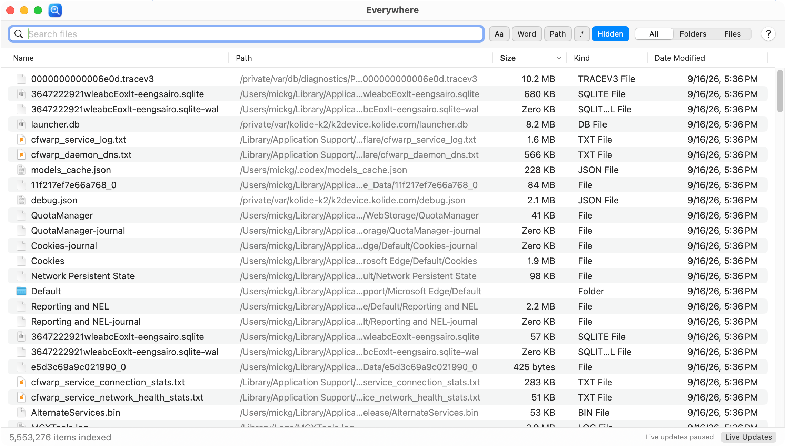
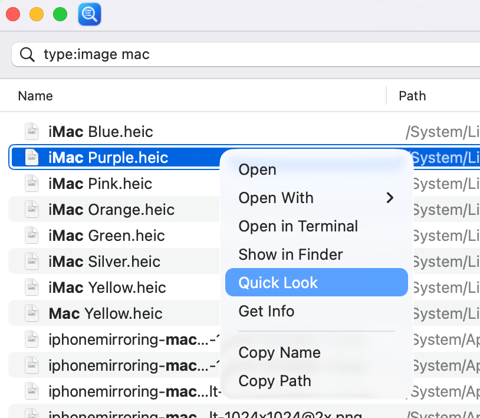
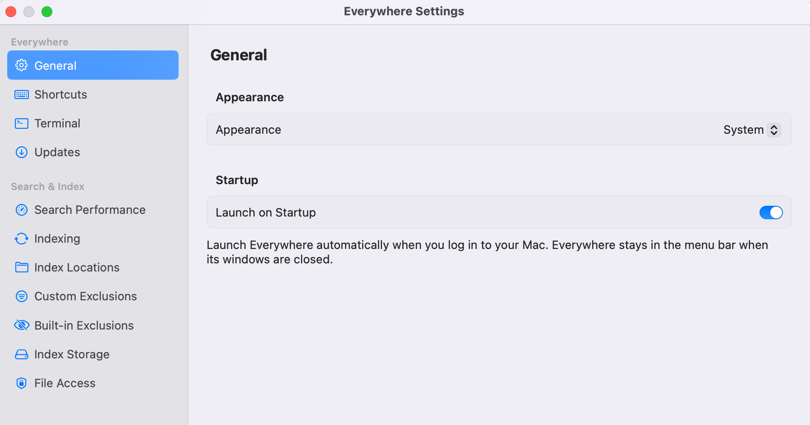

# Everywhere

Everywhere is a native macOS file-search app. Search file and folder names, narrow
results with path and pattern matching, and open items directly from a native results table.

It indexes names and filesystem metadata, not document contents.



## Features

- Search as you type, with case, whole-word, path, regex, and hidden-file controls beside the search field.
- All, Folders, and Files filters; extension/type, size, modification-date, and folder-scope queries; sortable results and saved column layouts.
- Native **?** syntax tips beside the search controls, with a full offline search guide.
- Quick Look previews, bold match highlighting, and saved search history.
- Open files, reveal them in Finder, choose an application, open a directory in your default terminal, and copy names or paths.
- Runs in the menu bar when its windows are closed; open windows have normal app menus, a Dock icon, and a ⌘Tab entry. Includes a configurable global shortcut (default: **⌥Space**; change it in **Settings → Shortcuts**).
- Optional **Launch on Startup** in **Settings → General → Startup** opens Everywhere automatically when you log in. Enable it from the installed app; if macOS requests approval, use **Open Login Items…**.
- Search the saved index on launch, with a configurable 120-second indexing countdown.
- Pause/resume the countdown or scan, or disable indexing entirely in Settings.
- Live filesystem updates with a status-bar toggle, and journal replay to catch changes made while the app was closed.
- Configurable index locations and name-based exclusions.
- Signed GitHub release updates with startup checks, optional automatic installation, and install-and-relaunch. Change update preferences in **Settings → Updates**.



## Requirements

- macOS 13 or later.
- To build: a Swift 5.9 or newer toolchain, a macOS SDK, and Apple's command-line build tools.
  The package uses Swift 5 language mode.
- To bundle the offline Help book: Python 3 and [Pandoc](https://pandoc.org/installing.html) (`brew install pandoc`).
- SQLite and the macOS frameworks supplied by the operating system. Swift Package Manager downloads the pinned [Sparkle](https://sparkle-project.org) updater dependency.

## Install with one command

Download and install the latest release without Homebrew:

```sh
curl -fsSL https://raw.githubusercontent.com/micksmix/everywhere/main/Scripts/install.sh | sh
```

The script fetches the newest release zip from GitHub and installs it to
/Applications. Because `curl` does not apply macOS's quarantine flag, no
Gatekeeper prompt appears. Use **Everywhere → Check for Updates…** for subsequent updates, or re-run the script.

## Install with Homebrew

If you use [Homebrew](https://brew.sh), install a ready-made release build from
this project's tap:

```sh
brew tap micksmix/tap
brew trust micksmix/tap
brew install --cask micksmix/tap/everywhere
```

This places Everywhere.app in /Applications and picks up future releases with
`brew upgrade`. To build from source instead, see the next section.

The release build is signed ad hoc and is not notarized — Everywhere is open
source and does not participate in Apple's paid signing program. Copies that
carry a quarantine flag (Homebrew installs, browser downloads) show a
Gatekeeper prompt on first launch: approve it via **System Settings → Privacy
& Security → Open Anyway**. To skip the prompt entirely, clear the quarantine
flag after installing:

```sh
xattr -dr com.apple.quarantine /Applications/Everywhere.app
```

## Build and launch

From the project directory:

```sh
make test
make app
open .build/Everywhere.app
```

The app bundle is signed ad hoc for local use. This build workflow does not notarize it.

To install in Applications, quit any running copy first, then run:

```sh
make install
open /Applications/Everywhere.app
```

`make install` rebuilds the app and replaces `/Applications/Everywhere.app`.
Run only one copy when testing the global shortcut.

| Command | Purpose |
| --- | --- |
| `make test` | Run the XCTest suite |
| `make build` | Compile a release build |
| `make app` | Build and sign `.build/Everywhere.app`, including its icon and offline Help book |
| `make install` | Build and copy the app to Applications |
| `make dist` | Build a universal release bundle and zip it for the GitHub release |
| `make bump VERSION=x.y.z` | Set the release version (the Makefile is the single source) |
| `make release VERSION=x.y.z` | Test, bump, and push tag `v`*x.y.z*; Actions builds, publishes, and updates the tap |
| `make open` | Install and launch |
| `make run` | Run the debug executable from the terminal |
| `make clean` | Remove build artifacts; the user index remains separate |

## First use

1. Open Everywhere and choose **Home folder** (recommended), **Entire Mac**, or **Choose folders** before the first scan. Home includes `~/Library`. Existing installations keep their locations.
2. If the index is empty and protected file access is denied, a separate **Allow Full Disk Access** dialog appears before indexing. Use **Open Full Disk Access Settings**, enable Everywhere, then quit and reopen it. **Check Again** retries the check; **Continue with Limited Access** proceeds with accessible files.
3. Choose **Rebuild Index** after changing locations or exclusions. Let any current operation finish first.
4. Type a filename fragment. Try `report`, or `ext:pdf` for PDF files. Click **?** beside the search controls for syntax examples.
5. Select a result and press **⌘O**, or double-click it, to open it.

Full Disk Access gives more complete results and fewer permission prompts. The same settings button is available in **Settings → File Access**. Enable Everywhere (use **+** to add it from Applications if needed), then quit and reopen the app. If already scanned, choose **Reindex Accessible Files** there. Everywhere indexes filenames and metadata, not file contents. See the
[user guide](docs/USER_GUIDE.md) for setup, search examples, and troubleshooting.

### Filters, previews, and search history

Combine name terms with `ext:pdf;txt`, `type:image`, `size:>100MB`, or
`dm:pastweek`. Restrict a search to a folder with `in:"~/Documents/Reports"`
(including subfolders), or use `parent:~/Downloads` for direct children only.
`file:` and `folder:` restrict item kind. Filters support the existing `!` and `|`
operators; regex mode continues to interpret the entire query as a regular expression.
See the [filter reference](docs/USER_GUIDE.md#filter-by-type-size-date-or-folder)
for units, date boundaries, and examples.

Matching text is bold in results. Select a result and press **Space** or **⌘Y**
for Quick Look; arrow keys follow the selection while the preview is open.
Use **↑/↓** in the search field to revisit searches. Up to 50 queries are saved
when you submit, open/reveal results, or leave the search field. Down past the
newest saved query restores your draft. **Search → Clear Search History** removes
saved queries.

## How indexing works

Files appear automatically as indexing progresses, even with the search field empty.
You can search immediately; results refresh as more files become available.

The initial walk uses `getattrlistbulk` with a POSIX fallback. SQLite stores a compact
parent/name tree and an FTS5 index on names; full paths are reconstructed for results.

Indexing waits 120 seconds after launch by default. Change the delay in **Settings → Indexing**
using seconds, minutes, or hours. **Pause** freezes the countdown; **Resume** starts indexing immediately.
Disable **Enable indexing** to keep using the saved index without updates. **Rebuild Index**
bypasses the countdown when indexing is enabled. An empty index starts building immediately, skipping the delay when indexing is enabled.

Normal subsequent launches use a saved FSEvents checkpoint to reconcile changed
directories. A full check is needed when no valid checkpoint exists, the configuration
or volume identities change, the journal cannot be trusted, or the baseline is at least
seven days old. The seven-day check occurs at startup, not on a background schedule.
The first launch after upgrading from a version without checkpoints also needs a full check.

The index and checkpoint live in:

```text
~/Library/Application Support/Everywhere/
  index.sqlite
  index.sqlite.checkpoint
```

SQLite may also create WAL and shared-memory companion files. Preferences are stored
separately in UserDefaults. Rebuilding replaces the index cache, not the indexed files.

## Documentation and development

The GitHub Pages showcase is in `site/`. See [website preview and publishing](docs/WEBSITE.md) for setup and screenshot details.

- [User guide](docs/USER_GUIDE.md): everyday tasks, search syntax, shortcuts, and troubleshooting.
- [Contributor guidance](AGENTS.md): source layout, architecture constraints, and testing requirements.
- [Icon design](Resources/AppIcon-design.md): the vector artwork and menu bar adaptation.

Core logic is in `Sources/EverywhereCore`; SwiftUI and AppKit code is in
`Sources/Everywhere`. Tests live in `Tests/EverywhereCoreTests` and use isolated databases.
Run `make test` before finishing a change and keep builds free of warnings.

The icon source is `Resources/AppIcon.svg`. The build renders each ICNS size directly from the vector artwork and regenerates the bundle when
the source or `Scripts/make-icon.swift` changes.

### Index storage location

In **Settings → Index Storage**, use **Choose Existing…** to select a saved
Everywhere index, or **New File…** to choose where to build a new one. You can also enter
an absolute file path and click **Apply**. Quit and reopen Everywhere to use the selected
file. This does not move or copy the current index. **Use Default** restores
`~/Library/Application Support/Everywhere/index.sqlite` for the next launch.
Use a dedicated folder: the index's containing folder is excluded from indexing.

If the saved index cannot be opened, Everywhere explains the problem and uses a temporary
index for the session. Choose a writable location in Settings before restarting. If a
temporary index also cannot be created, Everywhere shows the error and quits.

Reconciliation preserves saved entries when a directory cannot be read completely.
Permission failures are counted as skipped; other read errors stop reconciliation so
the journal checkpoint does not advance past failed work.

The active path is shown in Settings; **Show in Finder** reveals that file. The saved
item count loads independently of the startup countdown. A loading message or read
error is shown separately from a confirmed empty index. If a saved database has no
entries, indexing starts immediately when enabled. You can also choose another existing index.

### Database compaction

To reclaim unused space immediately, open **Settings → Index Storage** and
click **Compact Index Now**. This compacts the active index without rebuilding it and
shows a completion message. It works during the startup countdown or with indexing
disabled; wait for any running or paused scan to finish first. Manual compaction skips
the automatic size thresholds below and requires sufficient temporary disk space.

Everywhere checks for unused database space after indexing finishes and at most once an
hour while indexing is idle. It compacts the database when at least 128 MiB and 25% of
its pages are unused, provided sufficient temporary disk space is available. The status
shows **Compacting index…** while this runs. File updates may wait during compaction;
searches continue using the saved index. Checks are deferred while scanning, paused,
waiting for startup, or indexing is disabled.

Settings has a category sidebar on the left and a focused detail pane on the right.
Search, indexing, locations, exclusions, storage, and file access have separate panes.
Drag the window edges to resize it; longer panes scroll.

### Appearance and terminal application

**Settings → General** lets you choose **System**, **Light**, or **Dark** appearance
and **Settings → Terminal** selects the application for **Open in Terminal**. Both choices are saved and
take effect immediately. Terminal.app is the default; custom terminals must support
opening folder URLs. The search window includes the Everywhere icon in its title bar.

Deleted files and folders are removed from the index when filesystem changes are
reconciled. Startup indexing catches up on changes made while Everywhere was closed.
Saved results may remain stale while indexing or live updates are disabled. Deleted
entries free database space for reuse; the compaction described above reclaims disk space.

Terminal quick-select buttons in **Settings → Terminal** find **Ghostty**,
**iTerm2**, **Warp**, **kitty**, or Apple **Terminal**. They check system and user
Applications folders, Utilities folders, common Homebrew locations, and macOS’s
registered applications. A match saves and displays the application path immediately.
If no installation is found, a message appears and your current selection is retained.
You can still use **Choose Application…** to browse manually.

### Faster filename searches

**Settings → Search Performance** includes **Keep filename index in memory**,
enabled by default. It caches packed names and metadata for substring, wildcard, OR, and
negated filename searches;
turn it off to use less active memory and query SQLite directly, which can be slower.
The cache and selected sort order warm in the background while indexing is idle, and
small index changes apply incrementally. Filename queries with metadata filters, such as
`type:image vacation`, also use the cache when there are no OR groups or folder/path
conditions. Other filtered queries, folder scopes, regex, and path queries use SQLite-backed engines. Folder scopes traverse parent links
before filename matching. Full paths are not retained in the memory cache.

Searches start immediately as you type. The first 200 results appear before more rows
load as you scroll, with an exact match count and no 10,000-result table cap. Narrowing
a plain query reuses its previous matches when the index and filters are unchanged.
The status time measures request-to-publication latency, including scheduling, but not
table drawing.

Plain searches now preserve punctuation and find fragments anywhere in a name. Clearing the search with **×** or **⌘K**
restores the recent-items view, and newer searches cancel obsolete work.

Older database schemas are rebuilt automatically on launch. The current search and help
improvements do not change the SQLite schema or require another rebuild. Benchmark details
and limitations are in [Search performance measurements](docs/SEARCH_PERFORMANCE.md).

The filename cache shares identical UTF-8 names, reuses match decisions when names
are highly repetitive, and rejects impossible ASCII matches using character masks.
Candidate and sort arrays use checked 32-bit positions; database IDs remain 64-bit.
Folder scopes and ordinary absolute directory-prefix queries traverse SQLite parent
links before matching names. SQLite remains the persistent index; no additional
binary index is created.

### Sorting, memory usage, and exclusions

Broad filename searches reuse up to three cached sort orders. Small file updates patch
the cache and these orders; larger changes reload the cache. The table remembers the
selected sort column and direction across launches. **Settings → Search Performance** shows estimated filename-cache and sort-array memory use.

**Settings → Custom Exclusions** includes **Excluded Folders** with a folder chooser and
**Excluded Name Patterns** such as `*.tmp; *.log`. Patterns match whole names; existing
substring exclusions still work separately. Rebuild the index after changing exclusions.

**Settings → Built-in Exclusions** lists the default path and name rules,
including `/System/Volumes`. Remove a rule with its minus button, then choose
**Search → Rebuild Index** to include those locations. Removals persist across launches;
**Restore Built-in Exclusions** restores the defaults without changing custom exclusions.
Name rules apply anywhere, so another overlapping rule may still exclude a folder.
Explicit index locations continue to override built-in path exclusions. The app's own
index-storage folder is shown separately as a locked exclusion to prevent indexing its
own writes.

Schema version 4 rebuilds indexes from older schemas to remove duplicate paths created
by folder updates. Live updates reuse the existing indexed folder tree.

Select a result and press **⌘I**, or right-click → **Get Info**, to open Finder’s own
information window. Get Info is also in the Search menu and supports up to ten selected
files or folders without changing the clipboard.

### Built-in help and license

Click the native **?** button at the right of the search row for concise syntax examples.
Click outside the tips or press **Escape** to dismiss them; the query stays unchanged.
**Full Search Guide** and **Help → Search Syntax** open the syntax topic directly.
Choose **Help → Everywhere Help** (or **⌘?**) to read the complete guide in the resizable Everywhere Help window.
Use **Find on Page** to search the current help page; press Return to advance to the next match.
The Back, Forward, and User Guide toolbar buttons navigate help pages.
The bundled help works offline and includes the overview, installation steps, search
performance notes, and Apache License 2.0. `make app` regenerates it from the Markdown
documents, so documentation changes ship with the app. The quick tips also work offline.
Unbundled runs (`make run`) open the corresponding online guide section for full help.

**Everywhere → About Everywhere** shows the Apache License 2.0 license and a link to
[the project on GitHub](https://github.com/micksmix/everywhere).

## How to release

A release is a `v`-tagged commit. GitHub Actions builds the universal zip,
publishes it as a GitHub release on this repository, and updates the tap's
cask. Publishing is one command:

```sh
make release VERSION=1.0.0
```

The target performs these steps in order:

1. Requires a clean working tree (including staged and untracked files), a new
   tag, and a version with three numbers. Commit the workflow and other changes first.
2. Runs the test suite; a failure stops the release.
3. Sets the version in the Makefile (`make bump VERSION=1.0.0`).
4. Commits the Makefile as `v1.0.0` (skipped if the version was already
   committed), tags `v1.0.0`, and pushes the tag.

The tag push triggers the release workflow (`.github/workflows/release.yml`),
which runs the tests again, builds one universal app for ARM64 and Intel x86_64
using `swift build --arch arm64 --arch x86_64`, and verifies both architectures
and the ad-hoc signature. The app targets macOS 13 or later. It publishes
release `v1.0.0` with the zip, a SHA256 checksum file, and auto-generated notes,
then updates
`Casks/everywhere.rb` in `micksmix/homebrew-tap` with the matching version and
SHA256 calculated from the publicly downloaded release asset. Watch progress
under the repo's **Actions** tab. The tap job is separate: if it fails, fix the
secret or tap permissions and choose **Re-run failed jobs**. Rerunning the whole
workflow keeps an existing published zip and uses its checksum; it does not
replace release assets. Older releases do not overwrite the latest tap version.

Finish by pushing the main branch, which the target deliberately leaves to you:

```sh
git push
```

Verify through Homebrew: `brew install --cask micksmix/tap/everywhere` (or
`brew upgrade --cask micksmix/tap/everywhere` for existing installs).
`brew livecheck --cask micksmix/tap/everywhere` checks for upstream releases;
it does not install updates or edit the cask.

### Release authentication and one-time setup

GitHub Actions builds and publishes the release after a tag is pushed. Your
local Git credentials need permission to push that tag, but your local `gh`
login is not used by the workflow. Both the source repository and the tap
should be public so Homebrew users can download the release without credentials.
Enable GitHub Actions in `micksmix/everywhere` before the first release.
Configure the `SPARKLE_PRIVATE_KEY` repository secret using the [update release setup](docs/UPDATES.md) before publishing an update-enabled build. Each release includes a signed `appcast.xml` alongside the universal zip.

The build needs no personal access token. Publishing the zip to
`micksmix/everywhere` uses GitHub's automatically supplied `GITHUB_TOKEN`, with
`contents: write` granted by the workflow. That token is scoped to the
repository running the workflow, so it cannot also push changes to the separate
`micksmix/homebrew-tap` repository. The workflow uses `TAP_TOKEN` for that push.

Create the token in the tap owner's GitHub account (`micksmix`):

1. Open your account's **Settings → Developer settings → Personal access tokens
   → Fine-grained tokens**, then choose **Generate new token**.
2. Give it a descriptive name, choose an expiration, and set the resource owner
   to **micksmix**.
3. Under **Repository access**, choose **Only select repositories** and select
   **micksmix/homebrew-tap**.
4. Under **Repository permissions → Add permissions**, search for and select
   **Contents**, then set its access to **Read and write**.
5. Leave **Metadata → Read-only** if GitHub adds it automatically. No other
   repository or account permissions are needed, including Actions,
   Administration, and Workflows.
6. Click **Generate token** and copy the generated value.

Save the value in the **Everywhere repository**, where the workflow runs:

1. Open **micksmix/everywhere → Settings → Secrets and variables → Actions**.
2. Under **Repository secrets**, click **New repository secret**.
3. Set **Name** to `TAP_TOKEN` and **Secret** to the generated token value,
   then save it.

Use a **repository secret**, not an environment secret or an Actions variable.
The workflow reads `${{ secrets.TAP_TOKEN }}` and does not declare a deployment
`environment`, so an environment secret would not be available to it. The token
is scoped to the tap, but the secret belongs in Everywhere, not in the tap.

The tap's branch rules must allow the token owner's direct push. Renew the
repository secret before the token expires. If the tap update fails after the
release is published, correct the secret or permissions and choose
**Re-run failed jobs** in the release's Actions run.

Commit and push the workflow, Makefile, and documentation before running
`make release VERSION=x.y.z`. No local checkout of the tap is required for
this Actions workflow; it checks out `micksmix/homebrew-tap` itself.

`TAP_TOKEN` is unnecessary if you update the cask manually. A GitHub App
installation token or a write-enabled deploy key can replace the PAT with
corresponding workflow changes. See GitHub's
[workflow authentication documentation](https://docs.github.com/en/actions/tutorials/authenticate-with-github_token).

The release app is signed ad hoc and is not notarized. Homebrew installation
can succeed while macOS still requires approval on first launch; see Apple's
[opening apps safely](https://support.apple.com/en-us/102445) guidance.
To change the version without releasing, use `make bump VERSION=1.0.0`.

## Credits

Everywhere was inspired by two excellent instant-search tools: [Everything](https://www.voidtools.com/)
by voidtools, the classic Windows filename searcher, and [fsearch](https://github.com/cboxdoerfer/fsearch),
a fast file-search utility for Linux that follows the same idea. They showed how an index built from
filesystem metadata alone can make name searches feel instant. No source code from either project was
used — Everywhere is an independent implementation for macOS.
