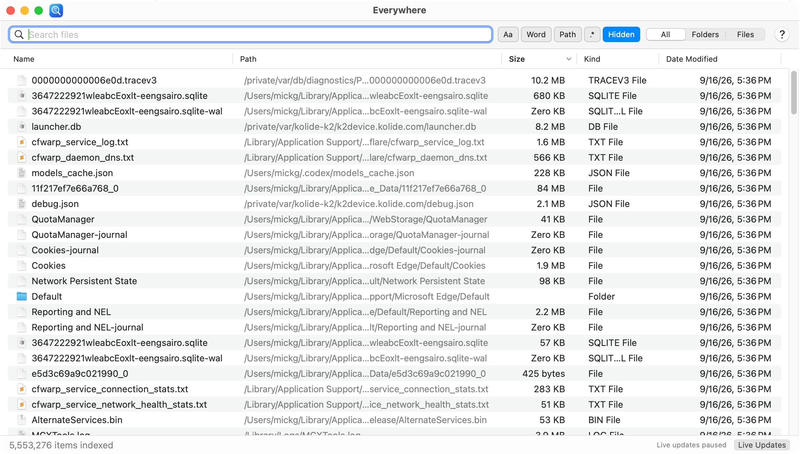

# Everywhere

Instant file and folder search for macOS 13 and later. Everywhere is a native app
that indexes filenames and metadata, so you can find files without searching their contents.



## Features

- **Search as you type:** filename fragments, wildcards, regex, boolean queries, and path matching.
- **Useful filters:** files or folders, extension, type, size, modification date, and folder scope.
- **Native results:** sortable columns, saved layouts, highlighted matches, and Quick Look previews.
- **File actions:** open, reveal in Finder, Get Info, Open With, Open in Terminal, and copy names or paths.
- **Easy access:** menu bar icon, configurable global shortcut (default **⌥Space**), and launch at login.
- **Fresh results:** live updates, catch-up after the app was closed, and optional daily, weekly, or monthly full checks.
- **Indexing controls:** choose folders and exclusions, pause or resume scans, and search the saved index immediately.
- **macOS conveniences:** search history, offline help, light/dark appearance, and built-in updates.

## Install

Install the latest release into `/Applications`:

```sh
curl -fsSL https://raw.githubusercontent.com/micksmix/everywhere/main/Scripts/install.sh | sh
```

### Homebrew

```sh
brew tap micksmix/tap
brew trust micksmix/tap
brew install --cask micksmix/tap/everywhere
```

Update through **Everywhere → Check for Updates…** or Homebrew.
The app is signed ad hoc and is not notarized. If macOS blocks the first launch,
allow it in **System Settings → Privacy & Security → Open Anyway**.

### Build from source

Requires Swift 5.9+, Apple's macOS build tools, Python 3, and
[Pandoc](https://pandoc.org/installing.html) (`brew install pandoc`).

```sh
make test
make app
open .build/Everywhere.app
```

Use `make install` to build and copy the app to `/Applications`.

## First use

1. Choose **Home folder**, **Entire Mac**, or specific folders to index.
2. For complete results, grant **Full Disk Access** in **Settings → File Access**, then quit and reopen Everywhere.
3. Type a filename fragment, double-click a result to open it, or press **Space** for Quick Look.

Try `report ext:pdf`, `type:image size:>10MB`, or `in:~/Documents dm:pastweek`.
Click **?** beside the search field for syntax tips.

## Documentation

- [User guide](docs/USER_GUIDE.md): setup, search syntax, shortcuts, and troubleshooting.
- [Changelog](CHANGELOG.md): release changes.
- [Search performance](docs/SEARCH_PERFORMANCE.md): measurements and limitations.
- [Contributor guide](AGENTS.md): architecture and development workflows.
- [Release guide](docs/RELEASING.md): builds, publishing, signing, and Homebrew tap setup.
- [Website guide](docs/WEBSITE.md): preview and publishing.

## Credits and license

Inspired by [Everything](https://www.voidtools.com/) and
[FSearch](https://github.com/cboxdoerfer/fsearch); independently implemented for macOS.
Licensed under [Apache 2.0](LICENSE).
